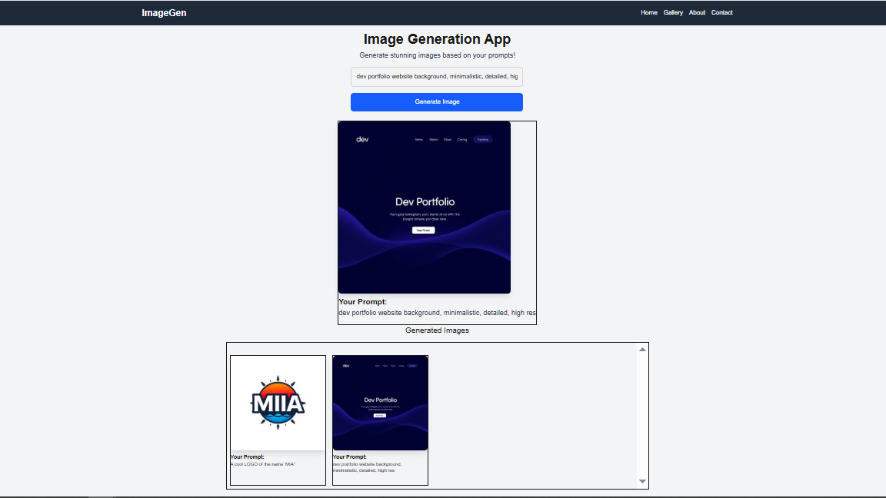

# AI Image Generator (Next.js + GPT-4)

A `Next.js` web application that generates `AI-powered images` from text prompts using the `GPT-4 Image Generation API`. Users can enter a creative idea, and the app will produce unique images instantly. Built with `TypeScript`, `Tailwind CSS`, and `React` best practices for a clean, responsive, and maintainable codebase.

---

## 📚 Table of Contents

- [Features](#features)
- [Demo](#demo)
- [Project Structure](#project-structure)
- [Tech Stack](#tech-stack)
- [Installation & Setup](#installation--setup)
- [Best Practices Implemented](#best-practices-implemented)
- [Credits](#credits)
- [Contact](#contact)

---

## Features

- **Text-to-Image Generation** – Powered by GPT-4 Image Generation API.
- **Secure API Handling** – API key stored in environment variables.
- **Responsive UI** – Works seamlessly on desktop and mobile.
- **Image Gallery** – View history of generated images with thumbnails and previews.
- **Custom Hooks** – Encapsulated API call logic with error handling and loading states.
- **Reusable Components** – Layout and functional components follow DRY principles.
- **Type Safety** – Full TypeScript integration with typed props and API responses.

---

## Demo



---

## Project Structure

```plaintext
alx-project-0x07/ (and subsequent versions)
├── components/
│   ├── common/
│   │   └── ImageCard.tsx
│   └── layouts/
│       ├── Footer.tsx
│       ├── Header.tsx
│       └── Layout.tsx
├── constants/
│   └── index.ts
├── hooks/
│   └── useFetchData.ts
├── interfaces/
│   └── index.ts
├── pages/
│   ├── api/
│   │   └── generate-image.ts
│   ├── _app.tsx
│   └── index.tsx
├── public/
└── styles/
    └── globals.css
```

---

## Tech Stack

      

---

## Installation & Setup

1. Clone the repository
   ```bash
   git clone https://github.com/Mia06-coder/alx-project-0x05-setup.git
   cd alx-project-0x11
   ```
2. Install dependencies

   ```bash
   npm install
   # or
   yarn install
   ```

3. Set up environment variables

- Create a .env.local file in the root directory:
  ```bash
    NEXT_PUBLIC_GPT_API_KEY="API_KEY_GOES_HERE"
  ```

4. Run the development server

   ```bash
   npm run dev
   # or
   yarn dev
   ```

   > Visit: http://localhost:3000

---

## Best Practices Implemented

- **Component Organization:** Logical separation of layout, functional, and reusable components.
- **State Management:** Proper usage of useState and useEffect with type-safe definitions.
- **API Handling:** Server-side routes to protect API keys.
- **Security:** Environment variables and input sanitization.
- **UI/UX:** Responsive, mobile-friendly design with clear navigation.
- **Type Safety:** TypeScript interfaces for props and API responses.

---

## Credits

- Project idea & structure inspired by [ALX](https://www.alxafrica.com/) exercises
- Icons and badges from [Shields.io](https://shields.io/)

---

## Contact

Made with ❤️ by **Mia Mudzingwa**

- GitHub: [Mia06-coder](https://github.com/Mia06-coder)
- LinkedIn: [mia-mudzingwa](https://www.linkedin.com/in/mia-mudzingwa)
